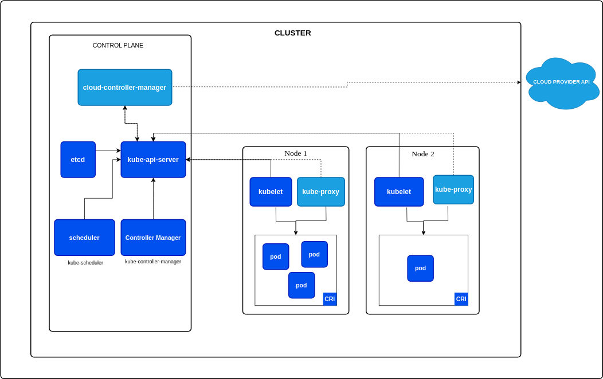

# KubernetesWorkbook

https://kubernetes.io/docs/concepts/architecture/


kubernetes is also known as k8s, an open source system for automating,
scaling,
and management of containerized application

it was originally developed by `google`, but now it is maintained by
CNCF - `CLOUD NATIVE COMPUTING FOUNDATION`


Kubernetes offer 
=================

1. Automatic bin packing -  k8s automatically schedules containers based on resource needs and constraints to maximize utilization without sacrificing availability

    - for eg, i want a nginx container, for that how much resource will be required, based on that, k8s schedules a container on a particular node

2. self healing - K8s automatically replaces and reschedules containers from failed nodes. It terminates and then restarts the containers that became unresponsive to periodic health checks.

    - it also prevents traffic being routed to unresponsive containers

3. Horizontal scaling - with k8s, applications are scaled manually or automatically based on cpu utilization

4. service discovery and load balancing
    -    containers receives IP address from k8s, while it assigns a single DNS name to a set of containers to aid in load balancing the incomming request.

5. automated rollouts and rollbacks => kubernetes seemlessly rolls out and rolls back application updates and thereby constantly monitoring the applications health to prevent any downtime

6. Secret and configuration management - kubernetes manages sensitive data and configuration details for an application separately from the container image in order to avoid rebuild of the respective image

7. storage orchestration - kubernetes automatically mounts storage solutions to containers from  local nodes / external cloud  providers (azure, aws ebs) / network storage systems ( isci,NFS)


8. ipv4 & ipv6 dual stack => ]k8s supports both ipv4 and ipv6 addresses


# KUBERNETES ARCHITECTURE

in k8s cluster, there must be 
- one or more control plane ( master) nodes 
- one or more worker nodes ( like slave nodes)


Functions

    -  by default control plane - runs system workloads
                  worker nodes -  runs application workloads


CONTROL PLANE COMPONENTS:
----------------------
1. API SERVER: ( central component - like HEART )
    - in order to comunnicate with k8s cluster, user sends requests to the control plane node via command-line `( KUBECTL )`, web UI, APIs.
    - all the administrative tasks are coordinated by the api server 
    - the api server receives the requests from users/ other components / external agent, validates and process the request
    - during processing, the api server reads the k8s cluster state from the key-value store (etcd) 
    - After processing the requests the resulting state of the k8s cluster is saved in the key-value store (etcd ) for persistence

2. Scheduler - the role of scheduler is to assign the new workload objects such as pods, to the worker nodes

    - during scheduling process, decisions are made based on the current k8s cluster state and based on the new workload object requirements
    - The scheduler also obtains the resource usage and resource availability on each worker node (`using the data from etcd`)
    - the scheduler will select the worker node that satisfies all the requirements for hosting the new workload

             - if worker node 1 with 80% cpu, worker node 2 with 90%, worker node 3 -with 20 % cpu, then scheduer selectes the nodes 3 to run the new workload ( running nginx , apps)

    -  the outcome / result is communicated back to the api server then the api server will instruct the worker node kubelet agent

3. controller manager = > the function is to regulate the state of the k8s cluster. Controllers are basically watch-loop processes continuously running and comparing the current state with the desired state ( like current state: 7, desired state: 10 replicas, then 3 more replicas needs to be created), 
    - controller manager will inform api server
    - api server will inform scheduler to get the latest cluster state and analyse to use which worker node providing the etcd data
    - scheduler will then informs api server
     - api server will inform kubelet of that particular node
     - the kubelet will inform its container runtime to run a pod
    
4. etcd - distributed key-value store that manages 
        
        -   cluster data
        -   metadata
    # - `out of all the control plane componets, only api server can talk to etcd` both for reading and writing
    


# worker node components

1. kubelet - it receives pod definitions from the api server and then it interacts with container runtime, such as docker

2. kubeproxy - the function of kubeproxy is to forward the connection requests to the containers in the pod

3. container runtime - docker, podman, rkt, containerd, cri-o


# pod 
        (naming convention - deploymentname-replicasetname-podname)
 - A pod is the smallest kubernetes object
 - it represents a single instance of the application
 - a pod encapsulates a container 
    - a pod is like vm, in which one or more containers running


# controllers
 - we can create pods directly, ` but practise is, should not create directly `
 - Because pods are ephemeral in nature ( short lived )
    -    pods dont have the capability to self heal themselves
- pods are used with controllers which handles pods replication, scaling, self healing, fault tolerance, etc...
            
            - so we can use controllers to create and manage pods
## examples of controllers:
1. deployment ( mostly used *** )
2. replica set
3. daemon set
4. stateful set
5. jobs, etc


### Deployment
 - A deployment provides declarative update for pods and replica sets
 - the pods definition are nested in the deployments using pod template
 - in forming the deployment, we tell the desired state and the deployment controller changes the actual state to desired state

 ### ReplicaSet 
 - it manages the replicas.
 - when we create a deployment a replicaset gets automatically created

 
 ===================================================
 # kubernetes Requirements
 1. 2 vCPU
 2. 2 Gib RAM
 3. 30 GB HDD


 to check status
 ```minikube status```

 check if any pods are there ?
 ```kubectl get pods```


 when we create any k8s workload objects, it gets created in the default namespace

 ### namespace : 
 - a kubernetes cluster can be divided into multiple mini clusters called namespace

=========================================

to check the list of namespaces:
`kubectl get ns`

it will list default, and other system namespaces

`kubectl get pds -n kube-system` - will list system workload containers / pods

to create own namespace
`kubectl create ns testns`


to create a pod - 
`kubectl run -interactive -terminal nameofthepod --imageIMAGENAME:7 --CMD`
EG:
```kubectl run -i -t mycentos --image=centos:7 -- bash```


command to delete pod
`kubectl delete pod mycentos`


=========================================

to create deployment

`kubectl create deployment web-deploy --image=nginx --port=80 --replicas=5`


to list deployment

`kubectl get deployment`

- after deployment  - it will also create replicaset 


`kubectl get replicaset`

command to get pod name and ip
`kubectl get pods,rs -o wide`


to access the application, we need to create a service

to create service

`kubectl expose deployment web-deploy --type=NodePort`


to list service
`kubectl get svc`

to get the url of the service
`kubectl service web-deploy --url`


==================================

# SERVICES

every pod gets a unique ip address

pods are ephemeral in nature

when a pod dies it will be replaced by a new pod which will have a different IP address


to overcome this situation
k8s provides a higher level of abstraction called `service` which logically groups the pods and defines a policy to access them.

### So service provides a stable IP address

and if you want to expose your application that is running on multiple pod replicas outside the cluster then you have to create a service

The service identifies the pods using selector through labels

Labels are key-value pair which are used to organize and select a subset of Pods

## Types of service

1. clusterIP ( default )
2. NodePort
3. LoadBalancer

ClusterIP : `( clusterIP address)`
    
- a service receives a virtual IP address known as cluster IP.
- this virtual IP address is used for communicating with the service and is ONLY accessible within the cluster

NodePort:  `(clusterIP address + random port)`

- in addition to cluster IP, a port is dynammically picked from the range 30,000-32,767 and is mapped to the respective service

- eg: if the mapped port is 32,750 for this service, if we connect to any worker node on port number 32750, we will be redirected to the assigned clusterIP of the service

- the nodeport type of service is useful if you want to make your service accessible to the external world ( outside the cluster)

LoadBalancer: `( clusterIP address + random port + external IP)`

- this external ip is the load balancer ip from extenal managed service ( aks, eks, gke ) for routing 

- this works only if we use managed cluster from cloud provider
- this type of service is exposed externally using the underlying cloud provider's load balancer

# HANDS ON

create 3 ec2 instances

ubuntu 20.04
t2.medium - 2cpus, 4gb ram
default vpc
subnet - any
security group - all traffic from anywhere (inbound)
 

