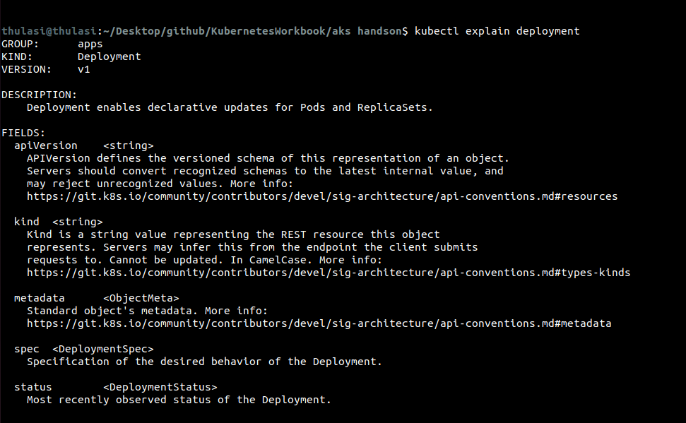

setup the cluster in AKS

nodecount: 2

it provides:
 - vmscaleset
 - nsg
 - route table
 - virtual network
 - metric alert rule
 - data collection endpoint
- data collection rule
- azure monitor workspace
- public ip address
- load balancer
- metric alert rule
- network watcher
- action group
- kubernetes service cluster
- managed identity( to orchestrate the vmss nodes)

verify if az cli and kubectl is installed

connect to the cluster

az account set --subscription XXXX

az aks get-credentials --resource-group samplerg --name thulasiaks --overwrite-existing

check if the cluster is up and running

`kubectl get deployments --all-namespaces=true`

check if the node pool is ready and running

`kubectl get nodes`

# WRITING MANIFEST FILES

instead of passing arguments / cli while creating pod, deployment, replicaset, service....

we can write the definition of the instance using yaml manifest files

things are mandatory :
    
    - apiVersion
    - kind ( deployment, service, rs, pod)
    - metadata ( data about apps, label,)
    - spec ( container count, image, port)

like man/get-help, in kubernetes to get the details about definition/manifest

kubectl explain pod

  

kubectl explain deployment

create a deployment
deploy.yml
 
 

apply the deployment

`kubectl apply -f deploy.yml`

check the status of the deployment

`kubectl get deployment`

in kubernetes, when we create a deployment, by default it automatically creates a replica set for set, to maintain the desired configuration env.

to list the replicaset

`kubectl get replicaset`

kubectl get pods

delete a pod and check if the desired state is retained automatically using replica set
`kubectl delete pod PODNAME`
 

 to access the application, we need to expose the application using 
 # service

 ## CREATE A SERVICE

 service.yml

 

 get the status of the service

 

and try to access the application using loadbalancer IP and with the nodeport

 # what if we need to change the deployment, from replica 5 to 15

 - just edit the deploy.yml and reapply

Delete a deployment

`kubectl delete deployment webdeploy`

Delete a service

`kubectl delete service web-service`

# dry run

- instead of we memorizing the yaml manifest / definition, copying it from the opensource / docs

we can use the dry run method and export the template to yaml

`kubectl create deploy mydeployment --image=nginx --port=80 --dry-run=client -o yaml > example-deploy.yaml`

## - to generate the template for service

kubectl expose deploy

# scale up/down the deployment instead of reapplying the deployment

`kubectl scale deploy webdeploy --replicas=20`

`kubectl scale deploy webdeploy --replicas=2`
 
 

 # roll out new version

 `kubectl set image deployment webdeploy myweb=nginx:1.25.4-alpine `
 `kubectl set image deployment DEPLOYMENTNAME CONTAINERNAME=IMAGENAME`

 

 to undo the changes

# deployment pods auto scaling

kubectl autoscale deploy webdeploy --min=2 --max=25 --cpu-percent=80

to get the list of autoscaling configuration

