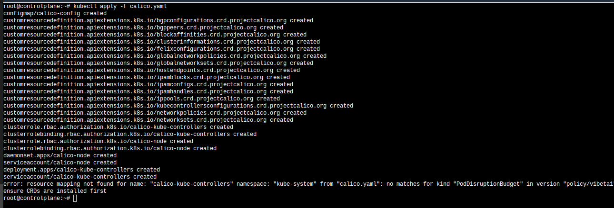

## multi node cluster

create 3 ec2 instances

1. create 3 EC2 instance

ubuntu 22.04
t2.medium
30GB HDD ,
create a new key pair
NSG -inbound to allow all traffic from anywhere

 

 ### CONNECT TO THE INSTANCE, SET THE HOSTNAME

sudo -i
 hostnamectl set-hostname XXX

 # initial setup on all nodes
 

 sudo -i

 swapoff -a
 
 ufw disable
 
 apt update
 
 ## docker setup

sudo apt install apt-transport-https ca-certificates curl software-properties-common

curl -fsSL https://download.docker.com/linux/ubuntu/gpg | sudo apt-key add -

sudo add-apt-repository "deb [arch=amd64] https://download.docker.com/linux/ubuntu $(lsb_release -cs) stable"

sudo add-apt-repository "deb [arch=amd64] https://download.docker.com/linux/ubuntu $(lsb_release -cs) stable"

sudo apt update

apt-cache policy docker-ce

sudo apt install docker-ce

# docker group to include user
logout

sudo usermod -aG docker $USER

## KUBEADM SETUP ( on all nodes )

sudo apt-get update && sudo apt-get install -y apt-transport-https curl

curl -s https://packages.cloud.google.com/apt/doc/apt-key.gpg | sudo apt-key add -

echo "deb https://apt.kubernetes.io/ kubernetes-xenial main" | sudo tee /etc/apt/sources.list.d/kubernetes.list

sudo apt-get update

sudo apt-get install -y kubelet kubeadm kubectl

sudo apt-mark hold kubelet kubeadm kubectl

# only on master

sudo -i

rm /etc/containerd/config.toml

systemctl restart containerd

    #   kubeadm init --apiserver-advertise-address < privateip of the ec2 master node>

copy the command to join the worker nodes

================<sample>====================
Your Kubernetes control-plane has initialized successfully!

To start using your cluster, you need to run the following as a regular user:

  mkdir -p $HOME/.kube
  sudo cp -i /etc/kubernetes/admin.conf $HOME/.kube/config
  sudo chown $(id -u):$(id -g) $HOME/.kube/config

Alternatively, if you are the root user, you can run:

  export KUBECONFIG=/etc/kubernetes/admin.conf

You should now deploy a pod network to the cluster.
Run "kubectl apply -f [podnetwork].yaml" with one of the options listed at:
  https://kubernetes.io/docs/concepts/cluster-administration/addons/

Then you can join any number of worker nodes by running the following on each as root:

kubeadm join 172.31.87.108:6443 --token cwoa5u.0pleq60ehasvb13c \
        --discovery-token-ca-cert-hash sha256:cb1936140eaa26fbc7fae3d35d55a1c40b661727eac66db0d3b2e1d1be384a63 

=======</sample>=============================

echo 'export KUBECONFIG=$HOME/admin.conf' >> $HOME/.bashrc
export KUBECONFIG=/etc/kubernetes/admin.conf

## Calico installation on master node to setup networking

wget https://docs.projectcalico.org/v3.20/manifests/calico.yaml

kubectl apply -f calico.yaml

kubectl get pods -n kube-system -l k8s-app=calico-node

  

then to use the cluster as normal user
logout
mkdir -p $HOME/.kube
sudo cp -i /etc/kubernetes/admin.conf $HOME/.kube/config
sudo chown $(id -u):$(id -g) $HOME/.kube/config

# join the worker nodes

sudo -i

rm /etc/containerd/config.toml

systemctl restart containerd

and kubejoin command output from master