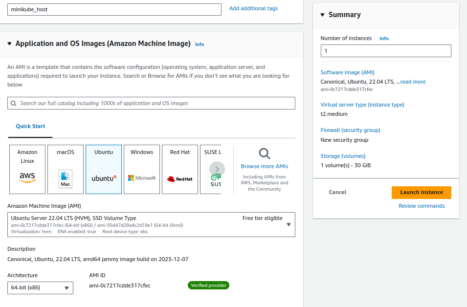
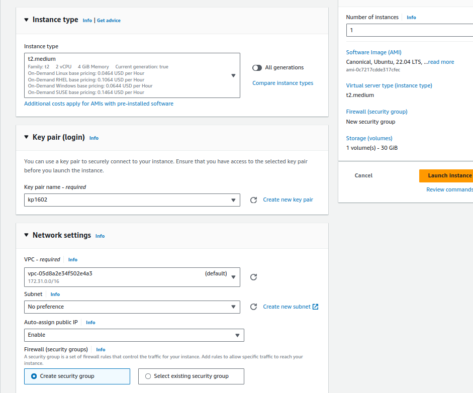
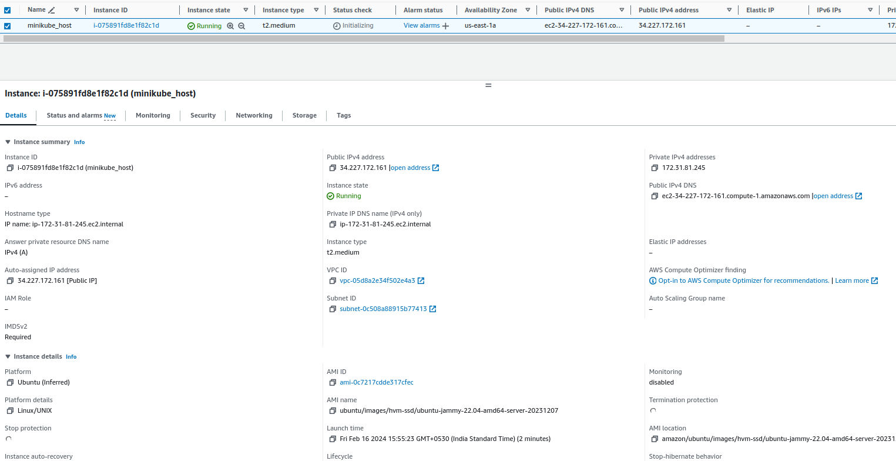
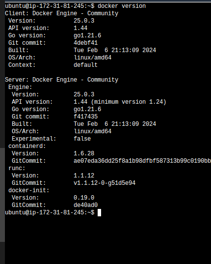
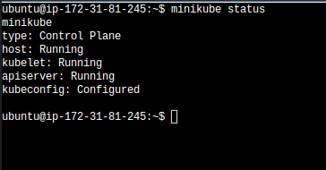
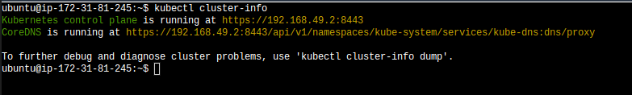
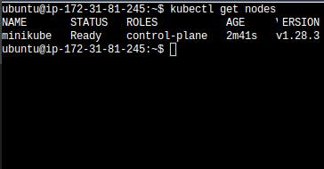

# Single node kubernetes cluster - Using Minikube

    Minikube is an open-source tool that facilitates running Kubernetes clusters locally on your machine. Kubernetes is a powerful system for managing containerized applications in a clustered environment, but setting up a Kubernetes cluster traditionally requires multiple machines or cloud resources, which can be complex and time-consuming, especially for development and testing purposes.

1. create a EC2 instance

ubuntu 22.04
t2.medium
30GB HDD ,
create a new key pair
NSG -inbound to allow all traffic from anywhere

 - switch as root user

sudo -i

 - update the repository

apt update

 - install 4 softwares

sudo apt install apt-transport-https ca-certificates curl software-properties-common

curl -fsSL https://download.docker.com/linux/ubuntu/gpg | sudo apt-key add -

sudo add-apt-repository "deb [arch=amd64] https://download.docker.com/linux/ubuntu $(lsb_release -cs) stable"

sudo add-apt-repository "deb [arch=amd64] https://download.docker.com/linux/ubuntu $(lsb_release -cs) stable"

sudo apt update

apt-cache policy docker-ce

sudo apt install docker-ce

### add the user to the docker group

- sudo usermod -aG docker ubuntu

and verify the docker version to list client and server status

# minikube installation

curl -LO "https://dl.k8s.io/release/$(curl -L -s https://dl.k8s.io/release/stable.txt)/bin/linux/amd64/kubectl"
chmod +x kubectl
sudo mv kubectl /usr/local/bin/

curl -LO https://storage.googleapis.com/minikube/releases/latest/minikube-linux-amd64
sudo install minikube-linux-amd64 /usr/local/bin/minikube

minikube start --driver=docker

## check
`minikube status`

Reboot the Ec2 instance

verify the cluster info `kubectl cluster-info`
 

Verify the node status `kubectl get nodes`

